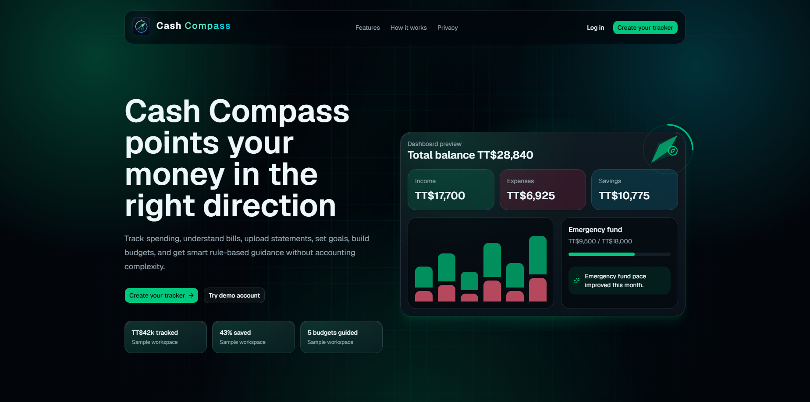
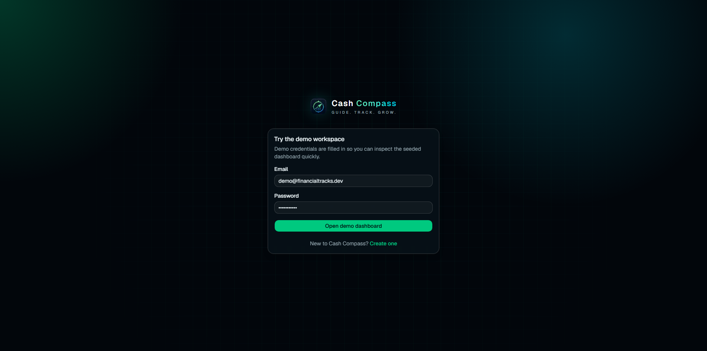
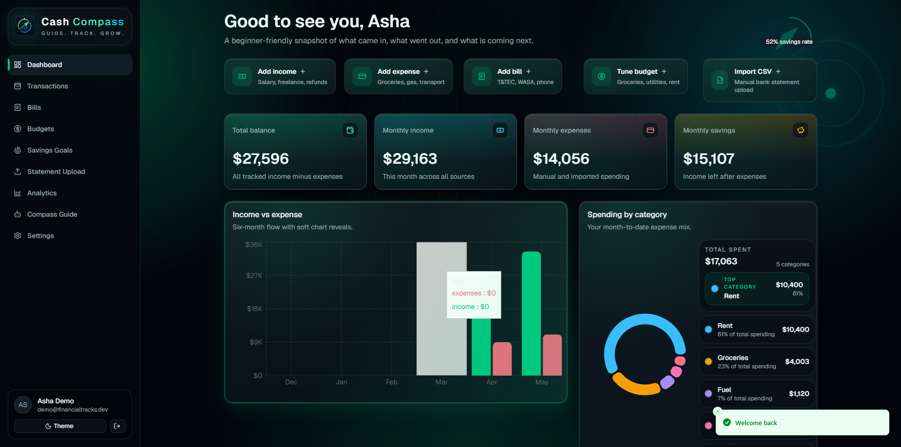
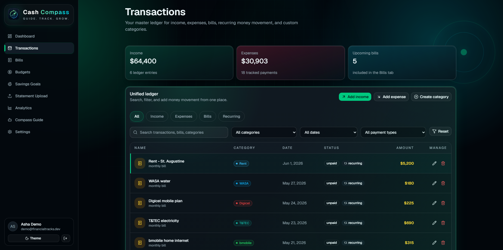
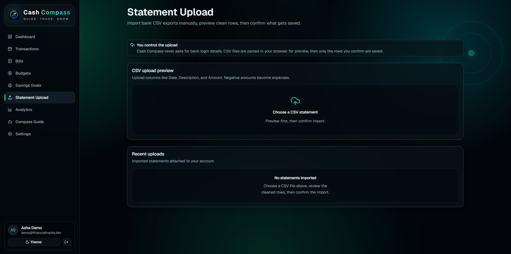
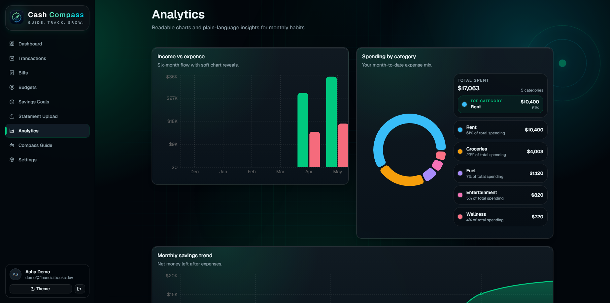

# Cash Compass

Cash Compass is a full-stack personal finance tracking web application designed to help users monitor income, expenses, bills, budgets, savings goals, uploaded CSV statements, and transaction activity through a polished dashboard. It includes authentication, protected routes, a seeded demo workspace, finance analytics, currency preferences, and privacy-conscious manual CSV import.

## Live Demo

Live app: [https://cash-compass-finance.vercel.app](https://cash-compass-finance.vercel.app)

## Demo Workspace

Use the seeded demo workspace to review the product with sample data:

- Email: `demo@financialtracks.dev`
- Password: `password123`

This account is seeded with Trinidad and Tobago-style sample data, including salary, freelance income, groceries, fuel, rent, T&TEC, WASA, Digicel, bmobile, budgets, savings goals, and transaction history.

For production-like documentation, a stronger demo password would be preferable. The seed password is intentionally unchanged for this portfolio demo batch.

## Project Overview

Cash Compass is a SaaS-style personal finance tracker built as a portfolio project. It focuses on beginner-friendly money visibility instead of accounting complexity. Users can track everyday finance records, inspect spending patterns, manage budgets and bills, upload CSV statements manually, and review rule-based financial insights in a responsive dark fintech interface.

## Key Features

- Public landing page with product positioning, dashboard preview, and privacy messaging
- Register/login authentication with protected app routes
- Seeded demo workspace with realistic sample finance data
- Protected dashboard with balance, income, expenses, savings, bills, goals, budgets, and insights
- New-user dashboard onboarding with quick-start actions for empty workspaces
- Income and expense tracking through a unified transaction workflow
- Bills management with due dates, frequency, category, and paid/unpaid status
- Budgets management with monthly limits, remaining amounts, and health states
- Savings goals with progress tracking and milestone-style feedback
- Unified transaction ledger with search, filters, tabs, edit/delete controls, and quick actions
- Custom category creation and Settings-based category management with safe edit/delete controls
- CSV/bank statement upload with column mapping, category review, and preview before import
- Currency preference support for TTD, USD, EUR, GBP, CAD, AUD, NZD, JPY, CNY, INR, SGD, AED, ZAR, JMD, BBD, and XCD
- Charts and analytics for income vs expenses, savings trends, and spending by category
- Rule-based finance assistant with smart demo insights and recommendations
- Settings and preferences for currency, session controls, user data export, privacy notice, and account deletion
- Privacy notice and security-focused product copy
- Responsive desktop/mobile layout with a polished dark fintech UI

## Screenshots

Public fintech landing page with demo CTA and privacy-focused messaging.



Seeded demo workspace for quick recruiter review.



Main finance dashboard showing balance, income, expenses, savings, charts, recent activity, bills, and goals.



Unified ledger for income, expenses, bills, recurring items, filtering, and search.



Manual statement upload flow with column mapping, category review, preview, and validation.



Finance insights and chart-based review experience.



## Tech Stack

- Next.js App Router
- TypeScript
- Tailwind CSS
- shadcn/ui and Base UI primitives
- Prisma 7
- Neon PostgreSQL
- Prisma Neon adapter and Neon serverless driver
- bcrypt password hashing
- HTTP-only cookies for sessions
- Recharts
- Framer Motion / Motion for React
- Anime.js for the compass animation motif
- Vercel deployment
- Vercel Analytics
- Vercel Speed Insights
- Upstash Redis-backed rate limiting when configured, with local in-memory fallback

## Architecture Overview

- `src/app` contains the Next.js App Router pages, route groups, metadata, and API routes.
- Public pages include the landing page and privacy notice.
- Protected app pages live under `src/app/(app)` and are wrapped by a server-side layout that requires an authenticated user.
- API routes live under `src/app/api` and handle auth, finance records, CSV imports, settings, sessions, user data export, and account deletion.
- Prisma models define users, sessions, categories, transactions, income, expenses, bills, budgets, savings goals, and uploaded statements.
- Neon PostgreSQL stores the application data.
- `src/lib/data.ts` centralizes finance data loading with user-scoped Prisma queries.
- `src/lib/finance.ts` contains summary, budget, chart, currency, and calculation helpers.
- CSV import uses a browser mapping and preview flow plus a server-side confirmation route before rows are stored.
- The production app is deployed on Vercel and uses environment variables for database and optional distributed rate limiting.

## Security & Privacy Highlights

Implemented security and privacy controls include:

- bcrypt password hashing
- HTTP-only session cookie named `cash_compass_session`
- session token hashing before database storage
- protected dashboard routes via server-side user checks
- user-scoped Prisma queries for finance data isolation
- CSRF/origin checks for state-changing API routes
- rate limiting for login, registration, CSV upload, and finance mutations
- CSP and security headers in `next.config.ts`
- logout current session and logout all sessions controls
- password reset support with hashed, expiring, single-use reset tokens
- email verification readiness with hashed, expiring, single-use verification tokens
- generic auth recovery responses to reduce email enumeration risk
- account deletion flow that removes user-scoped app data
- user data export/download that excludes password hashes, session hashes, and authentication secrets
- manual CSV upload instead of direct bank login
- CSV validation, column mapping checks, row limits, file size limits, category ownership checks, and spreadsheet formula-injection neutralization
- privacy notice describing stored data, analytics usage, CSV imports, and account deletion controls

Cash Compass is still a portfolio V1. Use sample/test data while the app continues to improve.

## Auth Recovery & Email Verification

Cash Compass includes password reset and email verification flows designed for production readiness:

- Forgot-password requests always return a generic response, whether or not the email exists.
- Password reset tokens are generated securely, hashed before storage, expire after a short window, and are consumed after use.
- Successful password resets invalidate existing sessions for that user.
- Email verification tokens are also hashed, expiring, and single-use.
- Raw recovery or verification tokens are never stored in the database.
- Local development can use a safe console fallback for reset and verification links when no email provider is configured.
- Production email delivery is environment-variable driven and should be configured through the hosting provider, not committed to the repo.

## CSV Upload Safety

The statement upload flow is intentionally manual and user-controlled:

- Users choose a CSV file themselves.
- CSV columns can be mapped to Cash Compass fields before import.
- CSV rows are previewed before import with type, amount, category, and validation status.
- Existing user categories can be assigned during review without creating categories automatically.
- Only confirmed rows are saved.
- No bank credentials are requested or stored.
- Server-side validation enforces mapping requirements, file size, payload size, row count, date format, amount limits, transaction type rules, and category ownership.
- Imported text is trimmed, normalized, length-limited, and neutralized if it starts with spreadsheet formula characters such as `=`, `+`, `-`, or `@`.
- Parser/internal errors are converted into clean user-facing API errors.

## Local Development Setup

```bash
npm install
copy .env.example .env
npm run prisma:generate
npm run db:migrate -- --name init
npm run db:seed
npm run dev
```

Open [http://localhost:3000](http://localhost:3000).

If the database schema already exists and you only need to sync the Prisma client, run:

```bash
npm run prisma:generate
```

## Environment Variables

Use `.env.example` as the safe template. Do not commit real secrets.

Required:

- `DATABASE_URL` - pooled Neon/PostgreSQL connection string used by the Next.js app and seed runtime

Optional:

- `DIRECT_URL` - direct Neon/PostgreSQL connection string for Prisma migrations/introspection
- `UPSTASH_REDIS_REST_URL` - Upstash Redis REST URL for distributed rate limiting
- `UPSTASH_REDIS_REST_TOKEN` - Upstash Redis REST token for distributed rate limiting
- `APP_URL` - canonical app URL used to build password reset and email verification links
- `EMAIL_FROM` - sender address for auth recovery and verification emails
- `RESEND_API_KEY` - optional Resend API key for production email delivery

Never commit real `.env` values, database credentials, API keys, auth secrets, Vercel tokens, Neon credentials, Upstash tokens, or email provider keys.

## Database / Prisma Notes

- Prisma schema: `prisma/schema.prisma`
- Prisma config: `prisma.config.ts`
- Seed script: `prisma/seed.ts`
- Generated Prisma client output: `src/generated/prisma`
- Local Prisma generation: `npm run prisma:generate`
- Local migration script: `npm run db:migrate`
- Demo data seed: `npm run db:seed`

The app uses Prisma 7 with the Neon adapter. The seed script creates the demo workspace and resets only that demo user's seeded finance data before inserting fresh sample records.

## Deployment

The app is deployed on Vercel:

[https://cash-compass-finance.vercel.app](https://cash-compass-finance.vercel.app)

Production requires `DATABASE_URL` in Vercel environment variables. `DIRECT_URL` is useful for Prisma migration workflows. Upstash Redis environment variables are optional but recommended for distributed production rate limiting.

For production password reset and email verification delivery, configure `APP_URL`, `EMAIL_FROM`, and `RESEND_API_KEY` in Vercel environment variables. Without an email provider, development logs safe test links to the server console; production does not expose recovery links to users when email delivery is not configured.

Vercel Analytics and Speed Insights are installed in the root App Router layout.

## Project Status

Current status: deployed portfolio project / V1.

Core finance tracking flows are complete:

- authentication and protected routes
- dashboard summaries
- transactions ledger
- income and expense tracking
- bills, budgets, and savings goals
- CSV import column mapping, category review, preview, and confirmation
- analytics and rule-based assistant
- settings, currency preferences, data export, privacy notice, and account deletion
- first-time onboarding guidance and empty-workspace setup links

Some product-level improvements remain before treating it as a production financial application for sensitive real data.

## Future Improvements

- Automatic category suggestions and reusable import rules
- Transaction CSV export and automated export scheduling
- Full integration tests for auth/session cookies and database-backed API authorization
- Real AI assistant integration later
- Budget alerts and notifications later
- Optional onboarding checklist persistence for multi-session setup progress

## Recruiter Highlights

- Built a full-stack finance SaaS-style app with Next.js, TypeScript, Prisma, Neon PostgreSQL, and Vercel
- Implemented custom authentication/session handling with bcrypt, hashed session tokens, and HTTP-only cookies
- Built a unified finance ledger covering income, expenses, bills, budgets, savings goals, custom categories, and CSV imports
- Added privacy-conscious CSV upload with column mapping, category review, server validation, row limits, and formula-injection hardening
- Added security hardening with CSRF/origin checks, rate limiting, CSP/security headers, password reset, email verification readiness, logout-all-sessions, user data export, and account deletion
- Designed a responsive fintech UI with charts, analytics, motion, branded assets, and realistic demo data

## Copyright & Usage

Copyright (c) 2026 Rohan Rampersad. All rights reserved.

This project is provided for portfolio and demonstration purposes only. You may not copy, redistribute, sell, or claim this project as your own without written permission. Real secrets must never be committed; use `.env.example` as a placeholder-only template.

## Quality Checks

Focused Node test coverage currently includes:

- category deletion guards for used and unused categories
- CSV import validation, debit/credit handling, formula neutralization, and category assignment safety
- user-scoping regression checks for category, ledger, statement upload, and account export routes
- data export serialization checks that exclude password/session fields
- finance validation checks for transaction, bill, and budget inputs
- auth token checks for hashing, expiry, single-use consumption behavior, and raw-token exclusion

```bash
npm run test
npm run typecheck
npm run lint
npm run build
```
